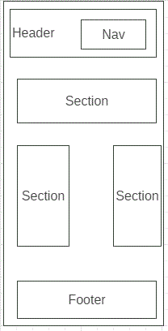

 For this project we created a web page named WebBranch using html and css using  git-github add commit push and merge process.

---
## Development Strategy

You can reach [`development-strategy.md`](./development-strategy.md)  
 some branch present in this project
- 1-Header-Footer
- 2-introduction
- 3-main-text
- 4- aside
---
## Wireframe

---
## LICENSE

[MIT](./LICENSE)

---